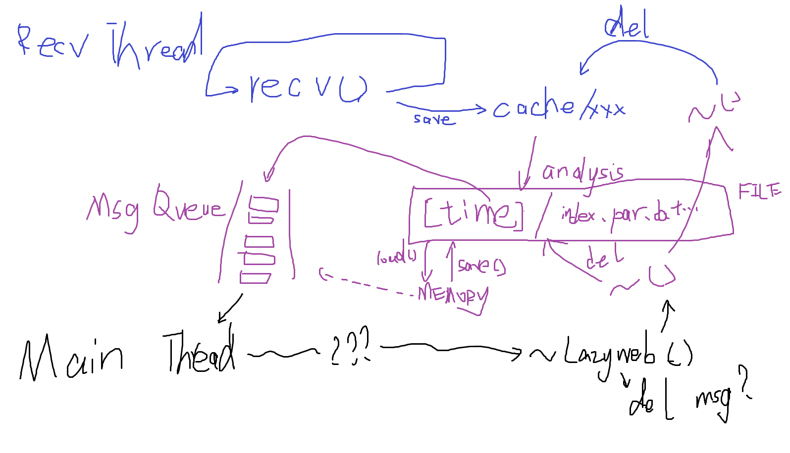

# LazyWeb
A new **HTTP** SDK strives to be perfect and easy to use. (I have developed mWeb but I thought it was trash so I decide to create this. ) Both **HTTP Client** and **HTTP Server** are supported in LazyWeb.

## Introduction
LazyWeb is based on **Windows API** and **OpenSSL**. LazyWeb is **multi-threaded**.

LazyWeb offers a class, `lazy::Web`, as the interface. It could be used to `connect()`, `write()`, `read()` for **client** use. The I/O is also suppored SSL. Also, `lazy::Web` offers `listen()`, `accpect()` for **server** use.

LazyWeb uses class `lazy::Msg` to manage http messages, and offers `lazy::WebHelper` to help developers to do web operation.

## Situation
The development of LazyWeb is nearly half-done. It's under development. mLazy drew this picture to show his basic ideas:

